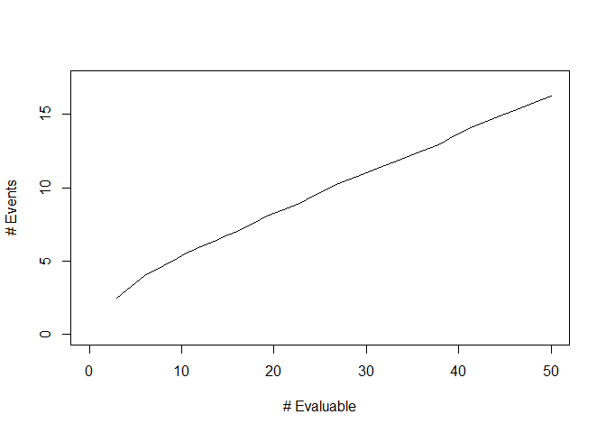

<!-- README.md is generated from README.Rmd. Please edit that file -->

# stoppingrule

<!-- badges: start -->
<!-- badges: end -->

## R package “stoppingrule”: Create and describe early stopping rules for clinical studies

stoppingrule is an R package that provides functionality for
constructing, describing, and evaluating stopping rules. Clinical trials
often include these rules in order to ensure the safety of study
treatments and feasibility of the study.

## Installation

The current version of stoppingrule is available in this repository. If
you have the R package “devtools” installed, stoppingrule can be
installed directly from GitHub with:

``` r
require(devtools)
install_github("mjmartens/stoppingrule")
```

## Example

Suppose a clinical trial of 30 patients is being developed. Study
investigators wish to monitor the occurrence of a specific toxicity
type, which occurs in 20% of patients in the target population based on
historical data. We want to create a stopping rule to test whether the
rate of a given toxicity exceeds 20% using a type I error rate of 10%.
Moreover, we wish to check the stopping rule continuously, after each
patient completes follow-up for the toxicity endpoint.

The function `calc.rule.bin` creates a ‘rule.bin’ object which contains
a matrix with the numbers of evaluable patients and their corresponding
stopping boundary values as well as the rule’s design parameters:

``` r
require(stoppingrule)
#> Loading required package: stoppingrule
bb_rule = calc.rule.bin(ns=1:30,p0=0.20,alpha=0.10,type="BB",param=c(0.6,2.4))
print(bb_rule)
#> $Rule
#>       N evaluable Reject bdry
#>  [1,]           1           2
#>  [2,]           2           3
#>  [3,]           3           3
#>  [4,]           4           3
#>  [5,]           5           4
#>  [6,]           6           4
#>  [7,]           7           5
#>  [8,]           8           5
#>  [9,]           9           5
#> [10,]          10           5
#> [11,]          11           6
#> [12,]          12           6
#> [13,]          13           6
#> [14,]          14           7
#> [15,]          15           7
#> [16,]          16           7
#> [17,]          17           7
#> [18,]          18           8
#> [19,]          19           8
#> [20,]          20           8
#> [21,]          21           9
#> [22,]          22           9
#> [23,]          23           9
#> [24,]          24           9
#> [25,]          25          10
#> [26,]          26          10
#> [27,]          27          10
#> [28,]          28          10
#> [29,]          29          11
#> [30,]          30          11
#> 
#> $ns
#>  [1]  1  2  3  4  5  6  7  8  9 10 11 12 13 14 15 16 17 18 19 20 21 22 23 24 25
#> [26] 26 27 28 29 30
#> 
#> $p0
#> [1] 0.2
#> 
#> $type
#> [1] "BB"
#> 
#> $alpha
#> [1] 0.1
#> 
#> $param
#> [1] 0.6 2.4
#> 
#> $cval
#> [1] 0.9630823
#> 
#> attr(,"class")
#> [1] "rule.bin"
```

The function call uses the Bayesian beta-binomial model approach
proposed by Geller et al. 2003 to construct the stopping boundaries and
displays the boundaries for the first few patients. A weakly informative
Beta(0.6,2.4) is specified for the toxicity probability. The
\`bb_rule\$Rule’ element of the output displays the number evaluable and
stopping criteria for all analyses; other elements contain the design
parameters and boundary parameter for the stopping rule. For this rule,
rejection is impossible with 1 or 2 evaluable patients because the
corresponding boundary values exceeds these numbers.

The function `table.rule.bin` can produce a succinct summary of the
stopping rule for the entire cohort from the rule calculated above:

``` r
table.rule.bin(bb_rule)
#>       N evaluable Reject If N >=
#>  [1,] "3 - 4"     "3"           
#>  [2,] "5 - 6"     "4"           
#>  [3,] "7 - 10"    "5"           
#>  [4,] "11 - 13"   "6"           
#>  [5,] "14 - 17"   "7"           
#>  [6,] "18 - 20"   "8"           
#>  [7,] "21 - 24"   "9"           
#>  [8,] "25 - 28"   "10"          
#>  [9,] "29 - 30"   "11"
```

We can also obtain a graphical summary of the stopping rule using the
`plot` function:



Lastly, the `OC.rule.bin` function can assess the operating
characteristics of this stopping rule. The rejection probability and
expected numbers of events at the time of stopping are computed at true
toxicity rates of p = 20%, 25%, 30%, 35%, and 40% as follows:

``` r
OC.rule.bin(rule=bb_rule,ps=seq(0.2,0.4,0.05))
#>         p Reject Prob E(events)
#> [1,] 0.20  0.09957367  5.651197
#> [2,] 0.25  0.23832301  6.536293
#> [3,] 0.30  0.43615256  6.926712
#> [4,] 0.35  0.64555222  6.819377
#> [5,] 0.40  0.81491087  6.355803
```
