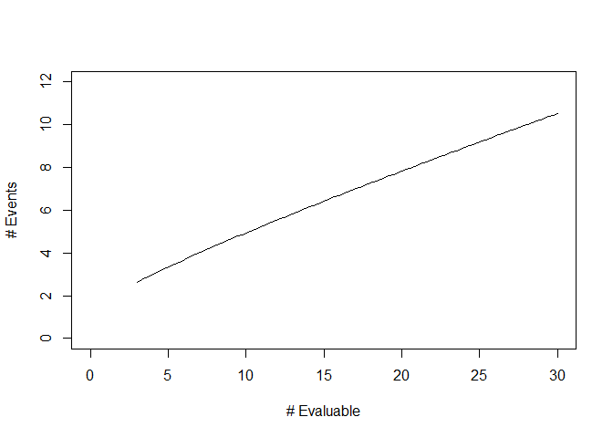

<!-- README.md is generated from README.Rmd. Please edit that file -->

# stoppingrule

<!-- badges: start -->
<!-- badges: end -->

## R package “stoppingrule”: Create and describe early stopping rules for clinical trials

stoppingrule is an R package that provides functionality for
constructing, describing, and evaluating stopping rules. Clinical trials
often include these rules in order to ensure the safety of study
treatments and feasibility of the trial.

## Installation

The current version of stoppingrule is available in this repository. If
you have the R package “devtools” installed, stoppingrule can be
installed directly from GitHub with:

``` r
require(devtools)
install_github("mjmartens/stoppingrule")
```

## Example

Suppose a clinical trial of 50 patients is being developed. Study
investigators wish to monitor the occurrence of a specific toxicity type
which occurs in 20% of patients in the target population, based on
historical data. We want to create a stopping rule to test whether the
rate of a given toxicity exceeds 20% using a type I error rate of 10%.
Moreover, we wish to check the stopping rule continuously, after each
patient completes follow-up for the toxicity endpoint.

The function `calc.rule` creates a matrix with the numbers of evaluable
patients and their corresponding stopping boundary values:

``` r
require(stoppingrule)
#> Loading required package: stoppingrule
poc_rule = calc.rule(ns=1:50,p0=0.20,type="Pocock",alpha=0.10)
head(poc_rule)
#>      N evaluable Reject bdry
#> [1,]           1           2
#> [2,]           2           3
#> [3,]           3           3
#> [4,]           4           3
#> [5,]           5           4
#> [6,]           6           4
```

The function call uses the Pocock-type test proposed by Ivanova et
al. 2005 to construct the stopping boundaries and displays the
boundaries for the first few patients. Note that rejection is impossible
with 1 or 2 evaluable patients because the corresponding boundary values
exceed these numbers.

The function `table.rule` can produce a succinct summary of the stopping
rule for the entire cohort from the rule calculated above:

``` r
table.rule(poc_rule)
#>       N evaluable Reject If N >=
#>  [1,] "3 - 4"     "3"           
#>  [2,] "5 - 6"     "4"           
#>  [3,] "7 - 9"     "5"           
#>  [4,] "10 - 12"   "6"           
#>  [5,] "13 - 16"   "7"           
#>  [6,] "17 - 19"   "8"           
#>  [7,] "20 - 23"   "9"           
#>  [8,] "24 - 26"   "10"          
#>  [9,] "27 - 30"   "11"          
#> [10,] "31 - 34"   "12"          
#> [11,] "35 - 38"   "13"          
#> [12,] "39 - 41"   "14"          
#> [13,] "42 - 45"   "15"          
#> [14,] "46 - 49"   "16"          
#> [15,] "50"        "17"
```

We can also obtain a graphical summary of the stopping rule using the
`plot` function:



Lastly, to assess the operating characteristics of this stopping rule,
we can use the `OC.rule` function. The rejection probability and
expected numbers of evaluated patients and events are computed at true
toxicity rates of p = 20%, 25%, 30%, 35%, and 40% as follows:

``` r
OC.rule(rule=poc_rule,ps=seq(0.2,0.4,0.05))
#>         p Reject Prob E(evalauted) E(events)
#> [1,] 0.20  0.09977254     46.72419  9.424838
#> [2,] 0.25  0.27689051     41.93172 10.607931
#> [3,] 0.30  0.53974016     34.66321 10.578964
#> [4,] 0.35  0.78266569     26.59365  9.552777
#> [5,] 0.40  0.92684148     19.62976  8.171903
```
